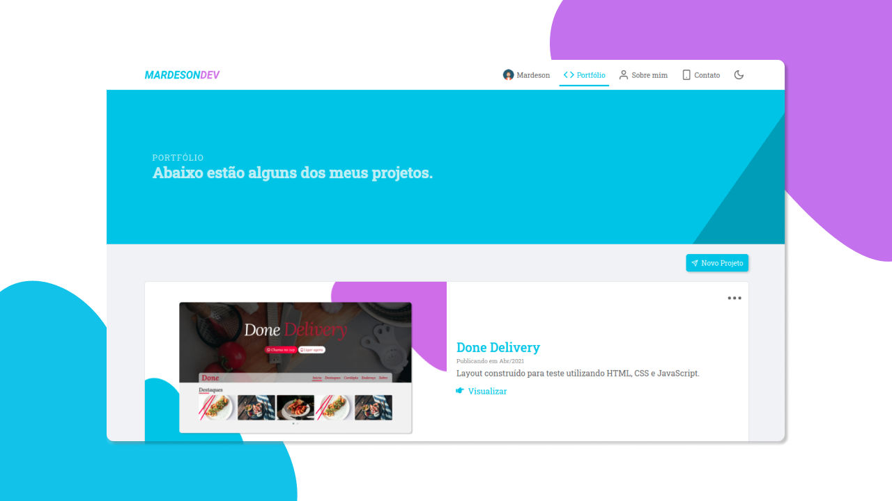

<h1 align="center">
  
</h1>

  <a href="#-tecnologias">Tecnologias</a>&nbsp;&nbsp;&nbsp;|&nbsp;&nbsp;&nbsp;
  <a href="#-projeto">Projeto</a>&nbsp;&nbsp;&nbsp;|&nbsp;&nbsp;&nbsp;
  <a href="#-layout">Layout</a>&nbsp;&nbsp;&nbsp;|&nbsp;&nbsp;&nbsp;
  <a href="#-utilizar">Utilizar</a>&nbsp;&nbsp;&nbsp;|&nbsp;&nbsp;&nbsp;
  <a href="#memo-licença">Licença</a>

 

  

  

 

## 🚀 Tecnologias

Esse projeto foi desenvolvido com as seguintes tecnologias:

- HTML
- CSS
- JavaScript
- ReactJS

## 💻 Projeto

Projeto desenvolvido para colocar em pratica meus conhecimentos.

## 🔖 Layout

Em breve...

## 📄 Utilizar

- <b>Requisitos:</b> NodeJS, Yarn e <a href="https://github.com/mardesonmax/api-portfolio">API Portfólio</a>
- <b>Primeiro:</b> Clone o repositório.
- <b>Execute:</b> `yarn` para instalar as depedencias.
- <b>Execute:</b> `yarn start` para iniciar o projeto.
- <b>Acesse:</b> <a href="http://localhost:3000">http://localhost:3000</a>

## :memo: Licença

Esse projeto está sob a licença MIT.

---

Feito com ♥ by Mardeson Pereira
